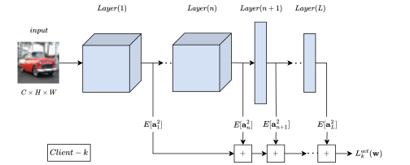

# Pytorch Implementation of FedMAN (WACV 2024 Main Conference).

<p align="center">
  
</p>

> [**Minimizing Layerwise Activation Norm Improves Generalization in Federated Learning**]()<br>
> [M. Yashwanth](https://www.linkedin.com/in/yashwanth-mandula-aba700a5), [G. K. Nayak](https://sites.google.com/view/gauravnayak), H. Rangwani, [A. Singh](https://www.linkedin.com/in/aryasingh007), R. V. Babu, [A. Chakraborty](https://anirbanchakraborty.github.io)<br>Indian Institute of Science, Visual Computing Lab

A novel approach that enhances Federated Learning (FL) algorithms by incorporating flatness constraints through a method known as Minimizing (Layerwise) Activation Norm (MAN). The MAN regularizer is designed to minimize the activation norms of neural network layers, leading to the minimization of the top eigenvalues of the Hessian of the loss function and ensuring convergence to a flat minimum. This method aims to improve generalization performance and can be seamlessly integrated with existing FL algorithms such as FedAvg, FedDyn, FedDC, and SAM-based methods. Experiments conducted on datasets like CIFAR-100 and Tiny-ImageNet demonstrate that the integration of MAN significantly boosts the performance of these algorithms while incurring minimal computational cost. Empirical evidence, through Hessian analysis, validates that the MAN regularizer effectively finds flatter minima, indicative of better generalization.

## :rocket: Main Results

### Top-1 accuracy

|Method|CIFAR-100|||Tiny-Imagenet|||
|:----:|:---:|:---:|:---:|:---:| :---: |:---:|
||$\delta$ = 0.3|$\delta$ = 0.6|IID|$\delta$ = 0.3|$\delta$ = 0.6|IID|
|FedAvg|49.9|40.39|39.4|25.35|24.41|23.75|
|FedAvg+MAN|52|52.42|52.59|28.09|28.9|29.11|
|FedSAM|43.44|43.36|41.31|26.23|26.04|23.97|
|FedSAM+MAN|51.59|52.62|52.85|32.16|32.6|31.4|
|FedDyn|49.29|49.91|50.04|29.23|28.99|29.41|
|FedDyn+MAN|55.27|55.63|55.83|32|32.44|32.31|
|FedDC|52.02|52.64|53.25|31.44|31.42|31.21|
|FedDC+MAN|55.21|55.4|56.77|35.7|36.07|36.53|
|FedSpeed|50.95|51.33|50.95|31.12|31.1|29.65|
|FedSpeed+MAN|55.23|55.84|55.89|34.32|35.49|33.02|

### Eigenvalue analysis (CIFAR-100)

|Method|Top-eigenvalue||Trace||
|:---:|:---:|:---:|:---:|:---:|
||$\delta$ = 0.3|$\delta$ = 0.6|$\delta$ = 0.3|$\delta$ = 0.6|
|FedAvg|51.49|53.39|8744|9056|
|FedAvg+MAN|43.8|42|4397|4747|
|FedSAM|32.46|35.32|4909|5160|
|FedSAM+MAN|29.29|30.05|2709|2918|
|FedDyn|51.03|47.03|6400|6717|
|FedDyn+MAN|44.84|38.44|3964|3966|

### Communication rounds

|Method|CIFAR-100|||Tiny-Imagenet|||
|:---:|:---:|:---:|:---:|:---:|:---:|:---:|
||$\delta$ = 0.3|$\delta$ = 0.6|IID|$\delta$ = 0.3|$\delta$ = 0.6|IID|
|FedAvg|500+|500+|500+|500+|500+|500+|
|FedAvg+MAN|206|210|224|437|194|182|
|FedSAM|500+|500+|500+|500+|500+|500+|
|FedSAM+MAN|326|281|301|104|87|82|
|FedDC|294|304|289|170|193|201|
|FedDC+MAN|144|129|156|73|66|61|

### Note:
Values for Top-1 accuracy have been obtained after averaging across three runs each with a different seed value.

## :hammer: Environment Setup

### Installation
The codebase is primarily dependent on the following libraries:
- Python 3.7 or higher
- Pytorch and torchvision
- Numpy
- [gdown](https://github.com/wkentaro/gdown) (required for downloading tiny-imagenet dataset)

### Getting Started
Please follow the instructions in [EXPERIMENTS.md](EXPERIMENTS.md) to get started with experiments.

## :pencil: Citation

If you think this project is helpful, please feel free to cite our paper:

```
@inproceedings{wacv2024_1253,
  title={Minimizing Layerwise Activation Norms Improves Generalization in Federated Learning},
  author={M. Yashwanth, G. K. Nayak, H. Rangwani, A. Singh, R. V. Babu, A. Chakraborty},
  booktitle={Winter Conference on Applications of Computer Vision (WACV)},
  year={2024}
  note={WACV #1253}
}
```